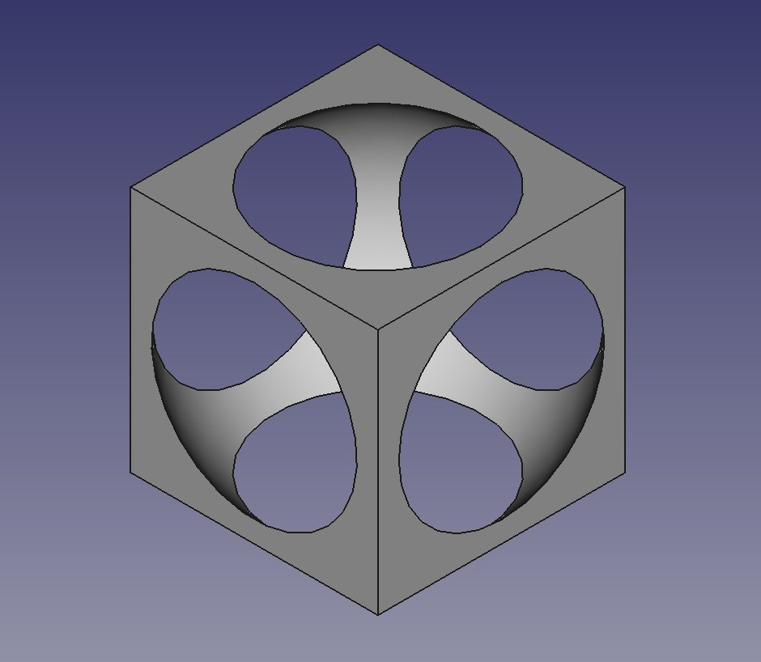

# OCC-CSG

[](https://travis-ci.org/miho/OCC-CSG) [](https://ci.appveyor.com/project/miho/occ-csg)


Simple but powerful CSG tool based on the OpenCascade CAD Kernel ([OCE](https://github.com/tpaviot/oce) edition)

This tool provides a simple command-line interface for applying boolean operations and transformations to 3D objects specified in either BREP/STEP or STL format. It contains a convenient STL importer for converting mesh based geometries to an eqivalent BREP representation (might cause performance issues for large STL files). Geometries can be exported as STL files as well.

## Sample

To get started quickly download a [binary release](https://github.com/miho/OCC-CSG/releases) (available for Linux, macOS and Windows on x64). On macOS occ-csg can be installed via [Homebrew](https://brew.sh):

    brew install miho/tap/occ-csg

These three lines

    occ-csg --create box -5,-5,-5,5,5,5 box.stp
    occ-csg --create sphere 0,0,0,6.5 sphere.stp
    occ-csg --csg difference box.stp sphere.stp cut.stp
    
produce this hollow cube:



To convert this resolution independent geometry to a triangulated STL file use:

    occ-csg --convert cut.stp cut.stl 0.1

The number at the end specifies the tolerance for the STL triangulation. Smaller values lead to better approximations. If the value is ommitted a default value (currently 0.5) will be used. This is how the resulting STL might look like:


## CLI

To get an overview over the CLI type `./occ-csg --help`:

```
------------------------------------------------------------
------      CSG Tool based on the OCE CAD Kernel      ------
------                 Version 0.9.1                  ------
------ 2018 by Michael Hoffer (info@michaelhoffer.de) ------
------                www.mihosoft.eu                 ------
------------------------------------------------------------
> ERROR: wrong number of arguments!.

USAGE:

Help & Info:

 occ-csg --help
 occ-csg --version

Creating Primitives:

 occ-csg --create box x1,y1,z1,x2,y2,z2                            box.stp
 occ-csg --create sphere x1,y1,z1,r                                sphere.stp
 occ-csg --create cyl x1,y1,z1,r,h                                 cyl.stp
 occ-csg --create cone x1,y1,z1,r1,r2,h                            cone.stp
 occ-csg --create polygons x1,y1,z1,x2,y2,z2,... p1v1,p1v2,p1v3,...:p2v1,p2v2,p2v3,... polygons.stp
 occ-csg --create 2d:circle x,y,r                                  2dcircle.stp
 occ-csg --create 2d:polygon x1,y1,x2,y2,...                       2dpolygon.stp
 occ-csg --create 2d:rect x1,y1,x2,y2                              2drectangle.stp
 occ-csg --create 2d:text font.ttf 12.0 x,y "text to render"       2dtext.stp
 occ-csg --create extrusion:polygon ex,ey,ez,x1,y1,z1,x2,y2,z2,... extrude.stp
 occ-csg --create extrusion:file ex,ey,ez                          2dpath.stp extrude.stp

Format Conversion:

 occ-csg --convert file1.stl file1.stp
 occ-csg --convert file1.stp file1.stl 0.1

Geometric Transformation:

 occ-csg --transform matrix    t1,t2,t3,...,t12 file1.stp file1-transformed.stp
 occ-csg --transform translate x,y,z            file1.stp file1-translated.stp
 occ-csg --transform scale     sx,sy,sz         file1.stp file1-scaled.stp

Boolean Operators, Constructive Solid Geometry (CSG):

 occ-csg --csg union file1.stp file2.stp file-out.stp
 occ-csg --csg difference file1.stp file2.stp file-out.stp
 occ-csg --csg intersection file1.stp file2.stp file-out.stp

Shape Editing:

 occ-csg --edit split-shape shape.stp stp
 occ-csg --edit round-edges radius shape.stp shape-rounded.stp

Bounds:

 occ-csg --bounds file.stp
 occ-csg --bounds file.stp bounds.stp
```

## How to build OCC-CSG

### Requirements

- C+\+ Compiler with C+\+11 support (tested with Clang, GCC, MSVC+\+ 2017 on x64)
- CMake >= 3.1
- [OCE](https://github.com/tpaviot/oce) = 0.18.3

#### Hints for building OCE:

For using `occ-csg` as independent command-line tool it is recommended to compile OCE as static library. This will increase the `occ-csg` file size but ensures the tool can be used without carrying too many additional libraries around. `occ-csg` comes with the freetype headers to simplify the build process on Windows. The recommended settings are:

```
    OCE_VISUALIZATION=ON
    OCE_BUILD_SHARED_LIB=OFF
    OCE_MULTITHREAD_LIBRARY=OPENMP
```

On macOS use these additional settings:

```
    OCE_OSX_USE_COCOA=ON
```

##### Dependencies required by OCE:

- FreeType: if freetype cannot be found on Ubuntu then install libfreetype6-dev, we use freetype-2.7 on Windows and macOS, to build static freetype on macOS, make sure to build without zlib, libpng, bzip2 and harfbuzz (otherwise it will have dynamic dependencies to these libraries)
- OpenGL:   if GL/GLU cannot be found on Unbuntu then install libglu1-mesa-dev and libgl1-mesa-dev
- XQuartz:  only necessary on macOS. Whether XQuartz is necessary depends on the version of macOS and OCE, see OCE documentation. It might be necessary to adjust the X11 include path via `ln -s /opt/X11/include/X11 /usr/local/include/X11`

#### Bash (Linux/macOS/Cygwin/other Unix-like Shell)

    cd /path/to/project
    mkdir build && cd build
    cmake .. -DOCE_DIR=/path/to/oce
    make -j4
    
#### Windows (CMD)

    "C:\Program Files (x86)\Microsoft Visual Studio\2017\Community\Common7\Tools\vsdevcmd" -arch=x64
    cd \path\to\project
    mkdir build
    cd build
    cmake .. -DOCE_DIR=\path\to\oce
    MSBuild .\occ-csg-prj.sln  /property:Configuration=Release /property:Platform=x64
    
For building large projects on Windows it might be preferable to use the x64 host compiler instead of the x86 compiler. Note that both compilers are able to produce x64 binaries. But the x64 compiler can use more memory during compilation. To really prevent that CMake picks the 64bit x86 host compiler just force cmake to use the x64 host compiler via

    -DCMAKE_VS_PLATFORM_TOOLSET_HOST_ARCHITECTURE=X64 -G "Visual Studio 15 2017 Win64"
